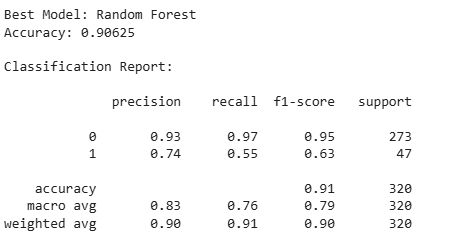
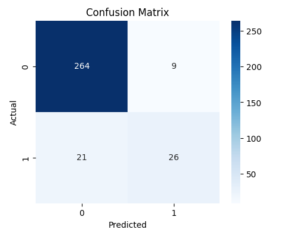
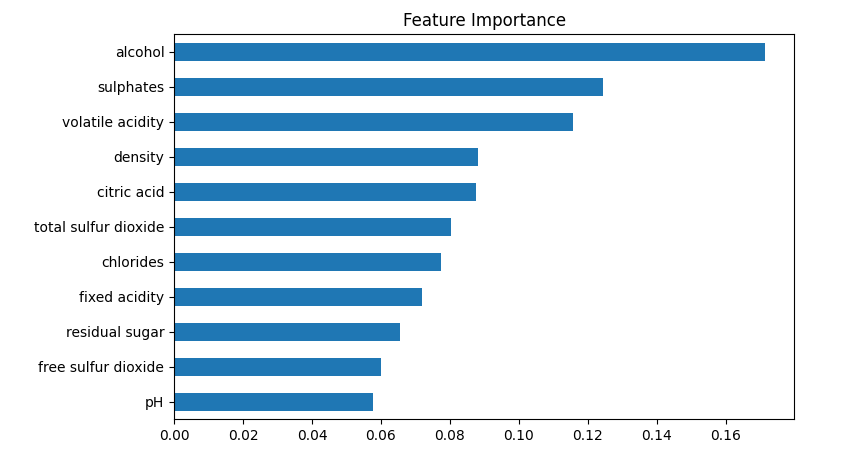

# 📌 Project Overview
This project applies multiple Machine Learning algorithms to predict wine quality based on physicochemical properties from the Red Wine Quality dataset. The goal is to classify wines into good quality or bad quality categories and compare model performances.
# 📂 Dataset
#### 1. Dataset Name: Red Wine Quality Dataset
#### 2. Source: UCI Machine Learning Repository
#### 3. Features:
- Fixed acidity
- Volatile acidity
- Citric acid
- Residual sugar
- Chlorides
- Free sulfur dioxide
- Total sulfur dioxide
- Density
- pH
- Sulphates
- Alcohol
#### 4. Target Variable:
  
  quality (converted into binary label goodquality)

- 1 → Good (quality ≥ 7)
- 0 → Bad (quality < 7)
# ⚙️ Project Workflow
### 1️⃣ Data Loading & Exploration
- Loaded dataset using Pandas
- Checked:
 Data types,Missing values,Statistical summary

### 2️⃣ Exploratory Data Analysis (EDA)
- Count plots
- Histograms
- Boxplots
- Feature distribution visualization

### 3️⃣ Feature Engineering
- Created binary classification target:

       wine['goodquality'] = [1 if x >= 7 else 0 for x in wine['quality']]

### 4️⃣ Feature Importance

Used ExtraTreesClassifier to determine which features most influence wine quality.
# 🤖 Models Implemented
The following algorithms were trained and evaluated:
- Logistic Regression
- K-Nearest Neighbors
- Support Vector Machine (SVM)
- Decision Tree
- Gaussian Naive Bayes
- Random Forest
- XGBoost

All models were evaluated using accuracy score and compared in a results table.
# 📊 Model Comparison
Models are sorted based on prediction accuracy to determine the best-performing algorithm for wine quality classification.

# 🛠️ Technologies Used
- Python
- Pandas
- NumPy
- Matplotlib
- Seaborn
- Scikit-learn
- XGBoost
# ▶️ How to Run
     pip install pandas numpy matplotlib seaborn scikit-learn xgboost
Then open the notebook:

      jupyter notebook redwinequality.ipynb
# 🎯 Key Learning Outcomes
- Practical understanding of classification problems
- Comparing multiple ML algorithms
- Feature importance analysis
- Model performance evaluation
- Data visualization techniques
